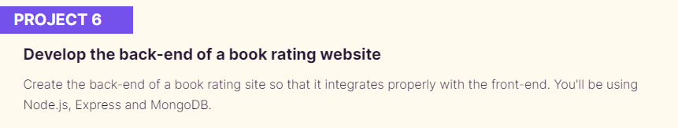

###

  
  
  
  
  

  ## Project n°6 from Openclassrooms's Web Development training program

## Setup guide
### Backend 
Go to backend folder and run in the console : 
 
`npm install` to install dependencies
 
`nodemon server` to start the server
 

### Frontend
Go to the frontend folder and run in the console : 
 
`npm install` to install dependencies
 
`npm start` to run the front
